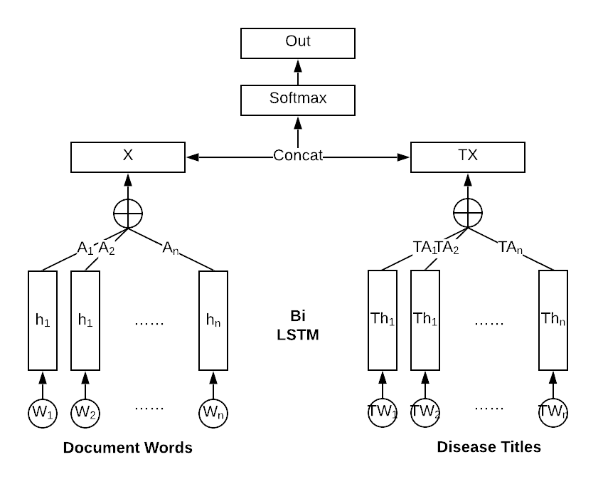
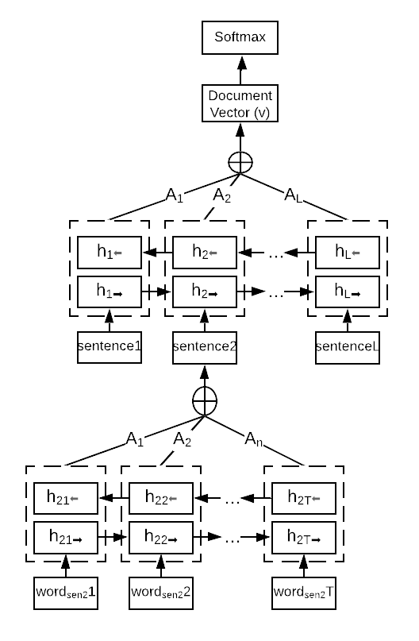

# icd_prediction
Predicting Medical Billing Codes (ICD9) from Clinical Notes (in MIMIC-III datasets) using Deep Learning

## Introduction
In this project, we investigate how to approximate the mapping from the medical notes to predict the medical codes in the revenue cycle. This can be achieved through multi-label classification, hierarchical classification, and information retrieval. In our work, We will implement 5 models: (i) Hierarchical Self Attention Network (ii) Self-Attention Long-Short Term Memory (SLSTM) (iii) Codes Attentive Long-Short Term Memory (CLSTM) (iv) Hierarchical Attention Network (HAN) (v) Fine Tuning on Pre-trained Clinical BERT.
Particularly, we try two types of attention mechanisms for different model architectures. All our models are validated on the publicly available MIMIC-IIIdataset using macro-F1, micro-F1 and precision@N metrics.

## Data
We will train and evaluate our approach on [MIMIC-III](https://www.nature.com/articles/sdata201635) (Medical Information Mart for Intensive Care). It is an open-access dataset comprising de-identified medical records from Beth Israel Deaconess Medical Center from 2001 to 2012. The data is associated with 58,976 distinct hospital admissions from 46,520 patients. Each record describes the diagnoses and procedures during a patient’s stay, including basic structured information, free-text clinical notes, and ICD-9 codes tagged by humans. A detailed description of the dataset could be found [here](https://mimic.physionet.org/). For the purpose of this project, we only used the tables below:

## Models
[TBD]
### LSTM (Long-Short Term Memory Networks)
Self-Attention Long-Short Term Memory (SLSTM) and Codes Attentive Long-Short Term Memory (CLSTM)

### HAN (Hierarchical Attention Network)

### BERT (Bidirectional Encoder Representations from Transformers)

## Authors

Ziyu(Andrea) Qiu @ziyuqiu zq64@cornell.edu
Ta-Wei(David) Mao tm592@cornell.edu
Jingxuan Sun js3422@cornell.edu
Yezhou(Yeats) Ma @YeatsMar ym462@cornell.edu
Yixue Wang yw2224@cornell.edu

