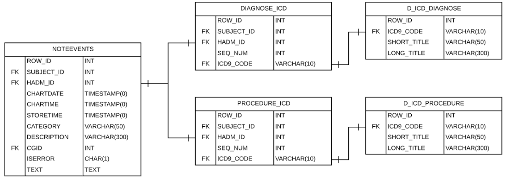

# Predicting Medical Billing Codes (ICD9) from Clinical Notes (in MIMIC-III datasets) using Deep Learning

[Under Construction]

## Introduction
This is the code for our final project for cs5787 Deep Learning at Cornell University. In this project, we investigate how to approximate the mapping from the medical notes to predict the medical codes in the revenue cycle. This can be achieved through multi-label classification, hierarchical classification, and information retrieval. In our work, We will implement 5 models: (i) Hierarchical Self Attention Network (ii) Self-Attention Long-Short Term Memory (SLSTM) (iii) Codes Attentive Long-Short Term Memory (CLSTM) (iv) Hierarchical Attention Network (HAN) (v) Fine Tuning on Pre-trained Clinical BERT.
Particularly, we try two types of attention mechanisms for different model architectures. All our models are validated on the publicly available MIMIC-IIIdataset using macro-F1, micro-F1 and precision@N metrics.

## Data
We will train and evaluate our approach on [MIMIC-III](https://www.nature.com/articles/sdata201635) (Medical Information Mart for Intensive Care). It is an open-access dataset comprising de-identified medical records from Beth Israel Deaconess Medical Center from 2001 to 2012. The data is associated with 58,976 distinct hospital admissions from 46,520 patients. Each record describes the diagnoses and procedures during a patient’s stay, including basic structured information, free-text clinical notes, and ICD-9 codes tagged by humans. A detailed description of the dataset could be found [here](https://mimic.physionet.org/). For the purpose of this project, we only used the tables below:

## Preprocessing
- [Data Processing](./Preprocess/data_processing.ipynb) file contains methods to extract, transform and load the medical notes and codes from corresponding tables. 
- [Note Sections](./Preprocess/note_sections.ipynb) file slice the medical notes into different sections, and then further sliced each section to individual sentences. By consulting literatures and medical professionals, the preprocess discarded meaningless portions, converted text to lowercase, removed stopwords and special characters, and peformed lemmatization and tokenization.
- [High Level Codes](./Preprocess/high_lvl_codes.ipynb) file mapps the low level ICD codes to higher levels and group them into categories.

## Models

### LSTM (Long-Short Term Memory Networks)
We experimented with Self-Attention Long-Short Term Memory (SLSTM) and Codes Attentive Long-Short Term Memory (CLSTM). Both are comparatively shallow networks with one core bi-directional LSTM layer for word-level encoding. Attention is used to generate a probability distribution over features, allowing models to put more weight on relevant features.
CLSTM takes an additional title matrix as input, and achieved superior peformance than the simpler SLSTM.
- [LSTM](./LSTM/LSTM.ipynb) contains the model and evaluation for the two LSTM models.
- [util](./LSTM/util.py) provides the code to extract the code titles (disease names) and build corpus.

### HAN (Hierarchical Attention Network)
HAN applies attention mechanisms at each hierarchical level of a document. As shown in the figure, sequence encoder and attention layers are applied at word-level first, and then at sentence-level to build a document vector. This document representation is used by the last fully-connected layer with its corresponding activation function for the final classification. This allows the model to progressively build a document vector by attending and aggregating encoders’ outputs at different levels, so as to better capture the hierarchical structure of documents and differentiate importance between contents.

### BERT (Bidirectional Encoder Representations from Transformers)
BERT is designed to pre-train a deep language representation model which can be easily fine-tuned with one additional output layer to solve the challenges of question answering and language inference etc. ClinicalBERT was trained specifically to conquer biomedical text mining tasks on the basis on BioBERT.

Our model is fine-tuned on Clinical BERT using all MIMIC notes version based on BioBERT-Base v1. + PubMed 200K + PMC 270K. We use its default setting as 28996 vocabulary size, 768 embedding dimension and the hidden state dimension is the same as 768. The pre-trained model ends with a BertPooler layer and is concatenated with a dense layer to output logits for multi-label prediction. Sigmoid activation function is leveraged to output probabilities for each code label based on the logits. Only those labels of probability greater than 0.5 would be considered positive. Since the exponential function in sigmoid can cause overflow issue, we apply gradient clipping to the logits before feeding it into the loss function. The clip norm is set as [-0.14, 0.14]. 

Due to the restriction of BERT’s maximum sequence length, we limit the maximum sequence length for our batched data as 512 and batch size is 8. Detailed codes are provided [here](./BERT/).

## Authors

- Ziyu(Andrea) Qiu @ziyuqiu zq64@cornell.edu
- Yezhou(Yeats) Ma @YeatsMar ym462@cornell.edu
- Jingxuan(Kelly) Sun @shakingkelly js3422@cornell.edu
- Ta-Wei(David) Mao @davidmao8419 tm592@cornell.edu
- Yixue Wang yw2224@cornell.edu

